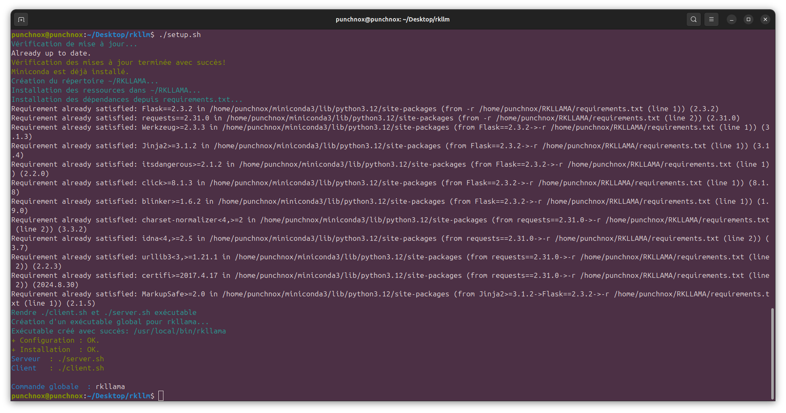
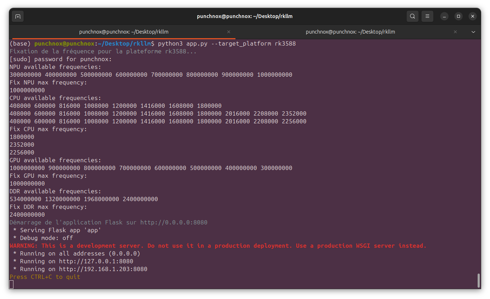
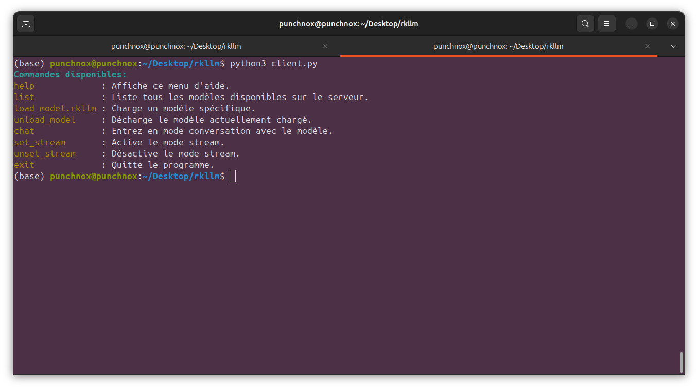
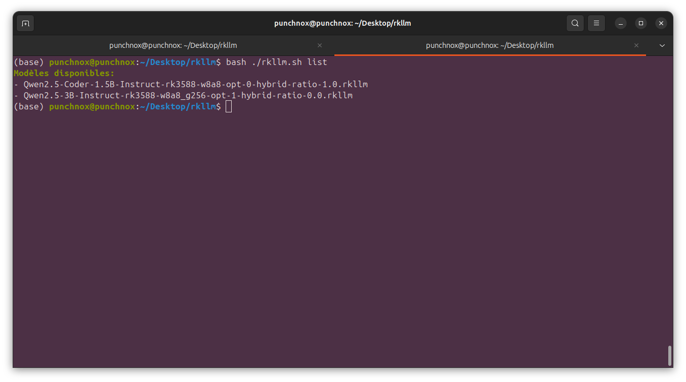
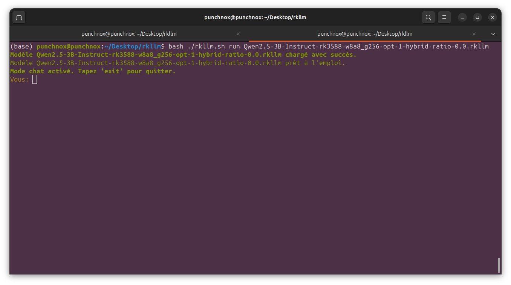
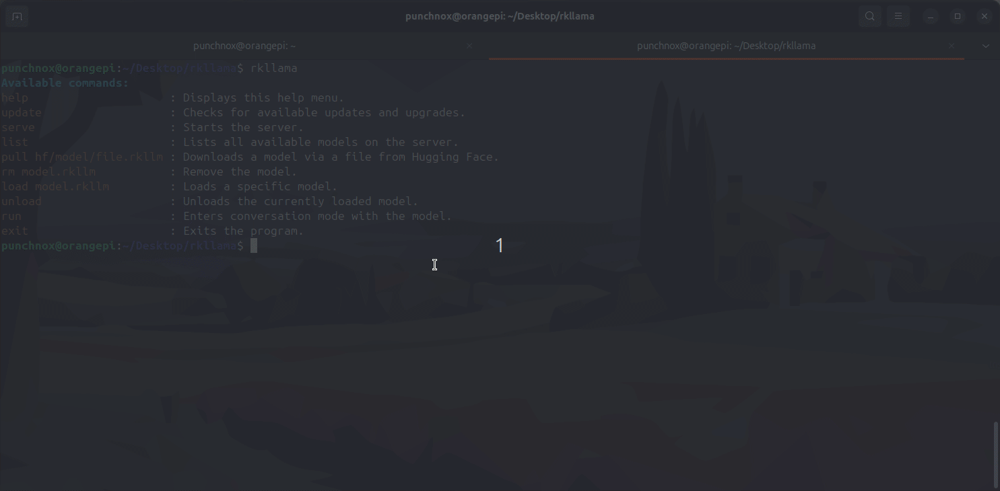
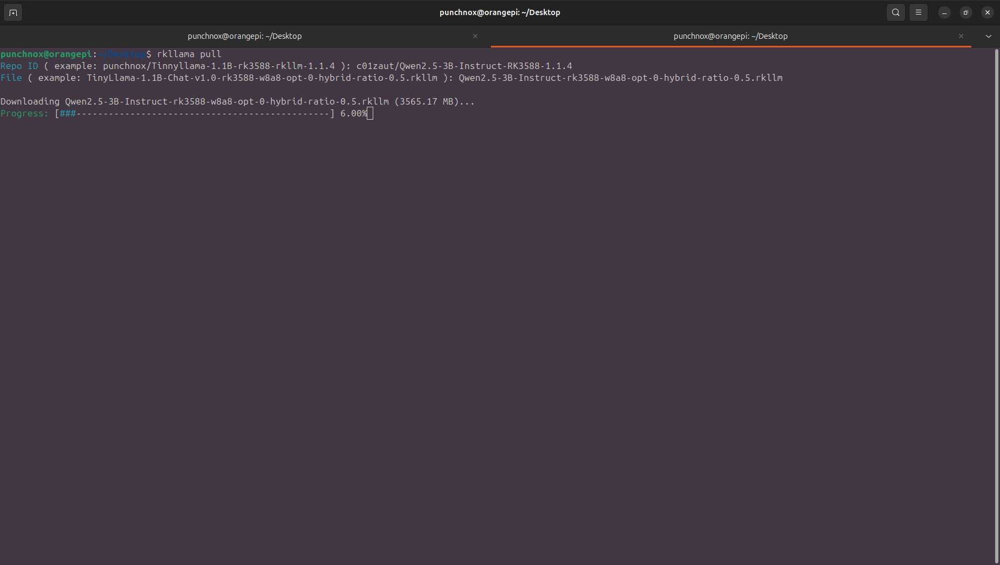
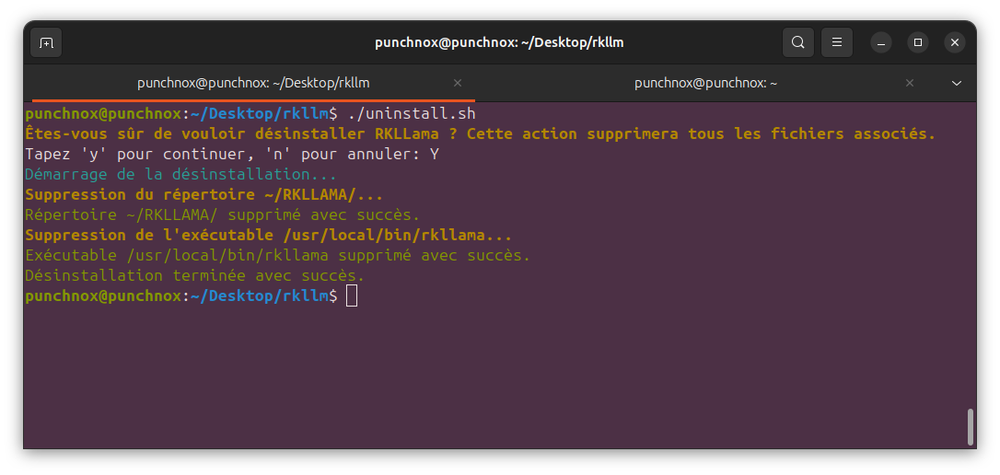

# RKLLama: LLM Server and Client for Rockchip 3588/3576

### [Version: 0.0.3](#New-Version)

Video demo ( version 0.0.1 ):

[](https://www.youtube.com/watch?v=Kj8U1OGqGPc)

##  Branches

-  [Without Miniconda](https://github.com/NotPunchnox/rkllama/tree/Without-miniconda): This version runs without Miniconda.
-  [Rkllama Docker](https://github.com/NotPunchnox/rkllama/tree/Rkllama-Docker): A fully isolated version running in a Docker container.
-  [Support All Models](https://github.com/NotPunchnox/rkllama/tree/Support-All-models): This branch ensures all models are tested before being merged into the main branch.
-  [Docker Package](https://github.com/NotPunchnox/rkllama/pkgs/container/rkllama)


## Overview
A server to run and interact with LLM models optimized for Rockchip RK3588(S) and RK3576 platforms. The difference from other software of this type like [Ollama](https://ollama.com) or [Llama.cpp](https://github.com/ggerganov/llama.cpp) is that RKLLama allows models to run on the NPU.

* Version `Lib rkllm-runtime`: V1.1.4.
* Tested on an `Orange Pi 5 Pro (16GB RAM)`.

## File Structure
- **`./models`**: contains your rkllm models.
- **`./lib`**: C++ `rkllm` library used for inference and `fix_freqence_platform`.
- **`./app.py`**: API Rest server.
- **`./client.py`**: Client to interact with the server.

## Supported Python Versions:
- Python 3.8 to 3.12

## Tested Hardware and Environment
- **Hardware**: Orange Pi 5 Pro: (Rockchip RK3588S, NPU 6 TOPS).
- **OS**: [Ubuntu 24.04 arm64.](https://joshua-riek.github.io/ubuntu-rockchip-download/)

## Main Features
- **Running models on NPU.**
- **Pull models directly from Huggingface**
- **include a API REST with documentation**
- **Listing available models.**
- **Dynamic loading and unloading of models.**
- **Inference requests.**
- **Streaming and non-streaming modes.**
- **Message history.**

## Documentation

* French version: [click](./documentation/french.md)

- Client   : [Installation guide](#installation).
- API REST : [English documentation](./documentation/api/english.md)
- API REST : [French documentation](./documentation/api/french.md)

## Installation

###  Standard Installation

1. **Clone the repository:**

```bash
git clone https://github.com/notpunchnox/rkllama
cd rkllama
```

2.  **Install RKLLama:**

```bash
chmod +x setup.sh
sudo ./setup.sh
```

**Output:**



###  Docker Installation

Pull the RKLLama Docker image:

```bash
docker  pull  ghcr.io/notpunchnox/rkllama:sha256-9cb0ad4be24fda16abf854a0efe0d678ecd71889c3e9c2c0b517c9ce1235bfa1.sig
```

*Set up by: [ichlaffterlalu](https://github.com/ichlaffterlalu)*

## Usage

### Run Server
*Virtualization with `conda` is started automatically, as well as the NPU frequency setting.*
1. Start the server
```bash
rkllama serve
```
**Output:**



### Run Client
1. Command to start the client
```bash
rkllama
```
or 
```bash
rkllama help
```
**Output:**


2. See the available models
```bash
rkllama list
```
**Output:**



3. Run a model
```bash
rkllama run <model_name>
```
**Output:**


Then start chatting *( **verbose mode**: display formatted history and statistics )*


## Adding a Model (`file.rkllm`)

### **Using the `rkllama pull` Command**
You can download and install a model from the Hugging Face platform with the following command:

```bash
rkllama pull username/repo_id/model_file.rkllm
```

Alternatively, you can run the command interactively:

```bash
rkllama pull
Repo ID ( example: punchnox/Tinnyllama-1.1B-rk3588-rkllm-1.1.4): <your response>
File ( example: TinyLlama-1.1B-Chat-v1.0-rk3588-w8a8-opt-0-hybrid-ratio-0.5.rkllm): <your response>
```

This will automatically download the specified model file and prepare it for use with RKLLAMA.

*Example with Qwen2.5 3b from [c01zaut](https://huggingface.co/c01zaut): https://huggingface.co/c01zaut/Qwen2.5-3B-Instruct-RK3588-1.1.4*


---

### **Manual Installation**
1. **Download the Model**  
   - Download `.rkllm` models directly from [Hugging Face](https://huggingface.co).  
   - Alternatively, convert your GGUF models into `.rkllm` format (conversion tool coming soon on [my GitHub](https://github.com/notpunchnox)).

2. **Place the Model**  
   - Navigate to the `~/RKLLAMA/models` directory on your system.
   - Make a directory with model name.
   - Place the `.rkllm` files in this directory.
   - Create `Modelfile` and add this :

   ```env
    FROM="file.rkllm"

    HUGGINGFACE_PATH="huggingface_repository"

    SYSTEM="Your system prompt"

    TEMPERATURE=1.0
    ```

   Example directory structure:
   ```
   ~/RKLLAMA/models/
       └── TinyLlama-1.1B-Chat-v1.0
           |── Modelfile
           └── TinyLlama-1.1B-Chat-v1.0.rkllm
   ```

   *You must provide a link to a HuggingFace repository to retrieve the tokenizer and chattemplate. An internet connection is required for the tokenizer initialization (only once), and you can use a repository different from that of the model as long as the tokenizer is compatible and the chattemplate meets your needs.*

## Uninstall

1. Go to the `~/RKLLAMA/` folder
    ```bash
    cd ~/RKLLAMA/
    cp ./uninstall.sh ../
    cd ../ && chmod +x ./uninstall.sh && ./uninstall.sh
    ```

2. If you don't have the `uninstall.sh` file:
    ```bash
    wget https://raw.githubusercontent.com/NotPunchnox/rkllama/refs/heads/main/uninstall.sh
    chmod +x ./uninstall.sh
    ./uninstall.sh
    ```

**Output:**



---

# New-Version

**Extended Compatibility**: All models, including DeepSeek, Qwen, Llama, and many others, are now fully supported by RKLLAMA.

**Enhanced Performance**: Instead of using raw prompts, inputs are now tokenized before being sent to the model, which significantly improves response speed.

**Modelfile System**: A new Modelfile system—modeled after Ollama—has been implemented. By simply providing the HuggingFace path, the system automatically initializes both the tokenizer and chattemplate. Additionally, it allows you to adjust parameters such as the model's temperature, its location, and the system prompt.

**Simplified Organization**: Models are now neatly organized into dedicated folders that are automatically created when you run the `rkllama list` command. Only the model name is required to launch a model, as the `.rkllm` files are referenced directly in the Modelfile.

**Automatic Modelfile Creation**: When using the pull command, the Modelfile is generated automatically. For models downloaded before this update, simply run a one-time command (for example: `rkllama run modelname file.rkllm huggingface_path`) to create the Modelfile.

**Future Enhancements**: Upcoming updates will allow further customization of the chattemplate and enable adjustments to additional hyperparameters (such as top_k) to further optimize the user experience.

If you have already downloaded models and do not wish to reinstall everything, please follow this guide: [Rebuild Architecture](./documentation/Guide/en/Rebuild-arch.md)

---

## Upcoming Features
- OpenAI/Ollama API compatible.
- Add multimodal models
- Add embedding models
- Add RKNN for onnx models ( TTS, image classification/segmentation... )
- `GGUF/HF to RKLLM` conversion software

---

System Monitor:

---

## Star History


---

##  Author

*  [**NotPunchnox**](https://github.com/notpunchnox/rkllama)

##  Contributors

*  [**ichlaffterlalu**](https://github.com/ichlaffterlalu): Contributed with a pull request for [Docker-Rkllama](https://github.com/NotPunchnox/rkllama/tree/Rkllama-Docker) and fixed multiple errors.